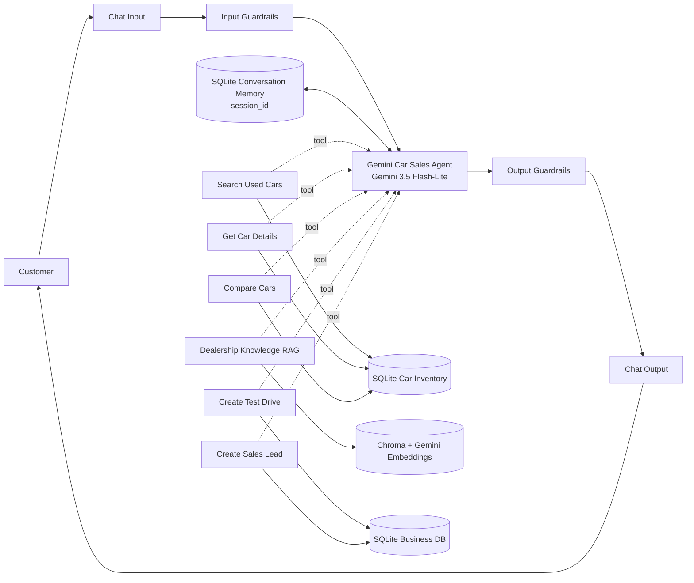

# AutoDrive AI — Langflow Car Dealership Prototype

A working Langflow-first prototype for the **AI Sales & Customer Service Agent** technical assessment.
The prototype is intentionally designed so the same behavior can later be ported to **LangGraph + Flask + ORM** for the final submission.

## What the flow does



### Conversation behavior

1. A vague request such as "عايز عربية" does **not** immediately search. The agent asks one useful follow-up.
2. Once it has enough constraints (for example budget + transmission/fuel/brand), it calls **Search Used Cars**.
3. Car facts and comparisons come only from the structured SQLite inventory.
4. Warranty / financing / dealership policy questions use **Dealership Knowledge RAG**.
5. The same `session_id` keeps conversation history, so later messages such as "قارن أول اتنين" or "احجزلي الأولى" can refer to earlier results.
6. Test drives and sales leads are **real SQLite writes**, not fake LLM confirmations.
7. Input and output guardrails surround the Agent.

## Model

The Agent component is configured for:

```text
gemini-3.5-flash-lite
```

RAG embeddings use:

```text
models/gemini-embedding-001
```

## Data

The intended inventory source is:

```text
https://www.kaggle.com/datasets/volkanastasia/dataset-of-used-cars
```

The package includes:

- `scripts/download_kaggle.py` — downloads that dataset with `kagglehub`.
- `scripts/prepare_db.py` — discovers common column aliases and normalizes the CSV into SQLite.
- `data/sample_used_cars.csv` — **synthetic test fixture only**, so the business logic can be smoke-tested without internet/Kaggle credentials.

The importer supports common aliases for brand, model, price, city, fuel, transmission, drive, mileage, origin, engine size/power, age, and year. It prints the mapping it actually discovered. If the exact Kaggle CSV uses a previously unseen column name, add that alias in `lib/car_dealership_core.py` after inspecting the printed mapping.

> Currency is deliberately not invented. The prototype returns the numeric `price` value from the dataset. Add the correct currency label after inspecting the exact source file/metadata you will submit with.

---

# Fastest setup: Docker Compose

## 1) Create `.env`

Windows PowerShell:

```powershell
Copy-Item .env.example .env
```

Linux/macOS:

```bash
cp .env.example .env
```

Edit `.env` and set:

```env
GOOGLE_API_KEY=YOUR_REAL_GOOGLE_AI_KEY
```

For the recommended local prototype you may leave `LANGFLOW_API_KEY` blank because Compose enables Langflow local auto-login.

## 2) Build and run Langflow

```bash
docker compose build
docker compose up -d
```

Open:

```text
http://localhost:7860
```

## 3A) Load the real Kaggle dataset

```bash
docker compose exec langflow /app/.venv/bin/python /app/scripts/download_kaggle.py
docker compose exec langflow /app/.venv/bin/python /app/scripts/prepare_db.py /app/data/kaggle_used_cars.csv --db /data/car_dealership.db
```

## 3B) Or use the included sample fixture first

```bash
docker compose exec langflow /app/.venv/bin/python /app/scripts/prepare_db.py /app/data/sample_used_cars.csv --db /data/car_dealership.db
```

## 4) Build **and install** the exact Langflow canvas

After Langflow is running:

```bash
docker compose exec langflow /app/.venv/bin/python /app/scripts/build_and_install_flow.py
```

This command does two things:

1. Reads the live Langflow 1.12 component registry, including our custom components.
2. Uses Langflow's own current flow builder to create all nodes, turn the six business components into Agent Toolsets, connect the graph, lay it out, save the exact export, and POST it to Langflow.

The generated importable file appears on the host at:

```text
flow/Car_Dealership_Agent.flow.json
```

and the flow also appears directly inside Langflow as:

```text
Car Dealership AI Agent — Gemini 3.5 Flash-Lite
```

This live-registry build is intentional: Langflow serializes its current component templates and Toolset metadata into exported JSON, so generating against the actual installed 1.12.x registry is safer than shipping a stale export from another patch version.

To generate the JSON only without installing it:

```bash
docker compose exec langflow /app/.venv/bin/python /app/scripts/build_and_install_flow.py --no-install
```

---

# Test conversation

Keep the same Playground session.

### Turn 1

```text
عايز عربية أوتوماتيك
```

Expected behavior: asks a concise useful follow-up, usually budget or another important preference.

### Turn 2

```text
أقصى سعر 20000 وعايزها بنزين
```

Expected behavior: calls **Search Used Cars** and returns real rows from the loaded inventory with inventory IDs.

### Turn 3

```text
قارن أول اتنين
```

Expected behavior: uses memory to resolve the previous results and calls **Compare Cars**.

### Turn 4

```text
إيه نظام الـ test drive؟
```

Expected behavior: calls **Dealership Knowledge RAG**.

### Turn 5

```text
احجزلي أول عربية
```

Expected behavior: remembers which listing is first, then asks only for missing required data: name, phone, date, time.

### Turn 6

```text
أحمد، 01012345678، يوم 10 سبتمبر الساعة 5 مساء
```

Expected behavior: calls **Create Test Drive**, inserts a real `test_drive_requests` row and confirms only after a real `request_id` is returned.

### Turn 7

```text
وخلي حد من المبيعات يكلمني
```

Expected behavior: reuses known customer/selected-car context and calls **Create Sales Lead**, creating a real `lead_id`.

---

# Database tables

The prototype SQLite database contains:

- `cars`
- `test_drive_requests`
- `sales_leads`
- `conversation_messages`
- `knowledge_documents`

The final technical-assessment implementation can migrate these concepts to PostgreSQL + SQLAlchemy ORM.

## Inspect business actions

For quick verification from Python:

```python
from car_dealership_core import list_business_actions
print(list_business_actions('/data/car_dealership.db'))
```

Or inspect `runtime/car_dealership.db` with any SQLite client.

---

# RAG notes

Prototype knowledge files live under `knowledge/`:

- `test_drive_policy.md`
- `financing.md`
- `warranty.md`
- `faq.md`

These are **demo/synthetic policies**, not claims about a real dealership. Replace them with your final business knowledge before submitting the assessment.

At runtime, `DealershipKnowledgeRAG`:

1. syncs source files into `knowledge_documents`,
2. chunks the text,
3. embeds new chunks with Gemini embeddings,
4. stores/searches them in persistent Chroma,
5. returns retrieved context to the Agent.

The deterministic lexical fallback exists only so the RAG plumbing can be smoke-tested when no embedding API is available. With a valid `GOOGLE_API_KEY`, the intended mode is Chroma + Gemini embeddings.

---

# Guardrails

Input guardrails currently reject:

- empty input,
- oversized input,
- common attempts to override/reveal hidden prompts or bypass guardrails.

Output guardrails redact common secret-key patterns and raw Python traceback text before returning a message to the customer.

These are prototype guardrails, not a substitute for production safety controls.

---

# Local smoke test (does not require Langflow/Gemini)

The core business layer can be tested with only Python stdlib:

```bash
python scripts/smoke_test.py
```

The report is written to:

```text
runtime/smoke_test_report.json
```

It validates:

- CSV -> SQLite import
- structured inventory search
- get/compare car data
- actual Test Drive insert
- actual Sales Lead insert
- `session_id` memory persistence
- knowledge sync/retrieval fallback
- input/output guardrails

---

# Project files

```text
components/car_dealership/
  input_guardrails.py
  gemini_sales_agent.py
  search_used_cars.py
  get_car_details.py
  compare_cars.py
  knowledge_rag.py
  create_test_drive.py
  create_sales_lead.py
  output_guardrails.py

lib/
  car_dealership_core.py

scripts/
  download_kaggle.py
  prepare_db.py
  smoke_test.py
  build_and_install_flow.py

knowledge/
  *.md

data/
  sample_used_cars.csv

flow/
  architecture.mmd
  Car_Dealership_Agent.flow.json   # generated after Langflow starts

runtime/
  SQLite DB / test reports / Chroma data
```

---

# What has actually been verified in this package

## Verified in the build environment

- Python syntax compilation for all included `.py` files.
- CSV normalization against the included fixture.
- SQLite schema creation.
- Structured inventory search.
- Car retrieval/comparison core logic.
- Real SQLite test-drive write.
- Real SQLite sales-lead write.
- Conversation-memory persistence by `session_id`.
- Knowledge sync + deterministic retrieval fallback.
- Input/output guardrail core logic.
- JSON smoke-test report creation.

## Requires your runtime/API key for final live verification

The build environment used to prepare this package does **not** contain Docker/Langflow or your Google API key, so it cannot honestly execute the final Langflow canvas or make a real Gemini 3.5 Flash-Lite API call here.

That is why `build_and_install_flow.py` uses the **live registry on your own Langflow 1.12 instance** and why the package includes exact Docker setup and smoke tests. Once you run the four setup steps above, use the test conversation to verify the full model/tool/memory loop on your machine.

Do not claim the full Gemini UI runtime was tested until that final local run passes.

---

# Final assessment vs prototype

This Langflow package is the **visual/behavioral prototype**. The assessment PDF requires the final project to use LangGraph, Flask, ORM/database, RAG management, and an admin dashboard. After this prototype behavior is accepted, port the same nodes/tools/state into the final LangGraph application instead of submitting Langflow as a replacement for LangGraph.
